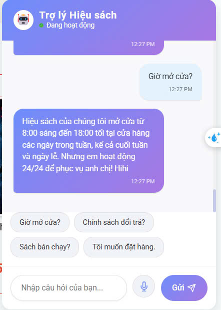
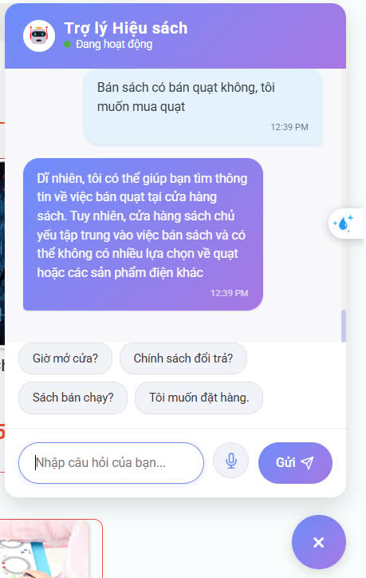

# Chatbot_RAG_Website_bansach

## Demo Screenshots

### Thông tin sách


### Câu hỏi cơ sản


### Bán sách bán quạt


### Giảm giá


Cách chạy:
1. Cài đặt các thư viện cần thiết:
```bash
pip install -r requirements.txt
```
Sửa database 'mongodb+srv://<your-links-database>' ở chatbotserver và backend
2. Chạy chatbot:
```bash
Tải file mô hình từ huggingface bỏ vào thư mục models của folder ServerChatbot 
https://huggingface.co/vilm/vinallama-7b-chat-GGUF/tree/main file Guff
cd /Chatbot/server.pypython server.py
3. Chạy website:
```bash
cd /Website Bán Sách/BTL_HTTMDT-main/fashion_book_backend-master
npm install
npm start
cd /Website Bán Sách/BTL_HTTMDT-main/fashion_book_frontend-master
npm install
npm start
4. Giao diện Website hiện lên, nhấn vào chatbot, chatbot sẽ trả lời câu hỏi của bạn
